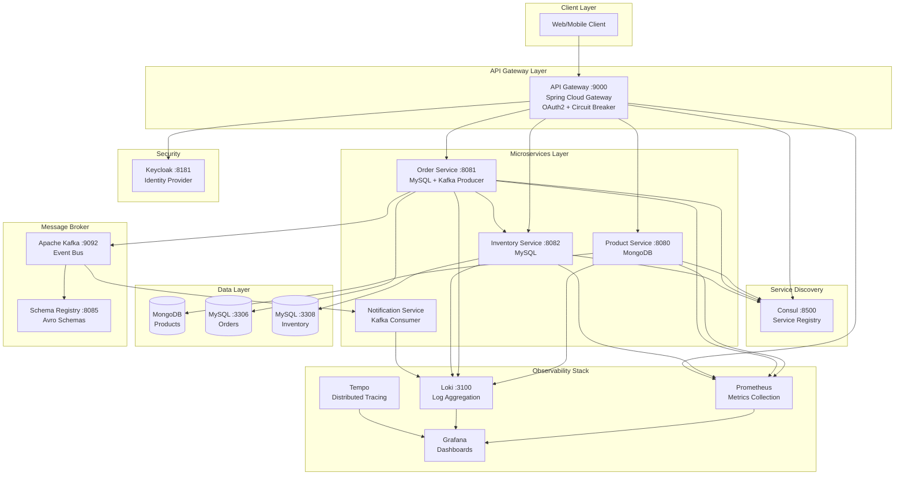
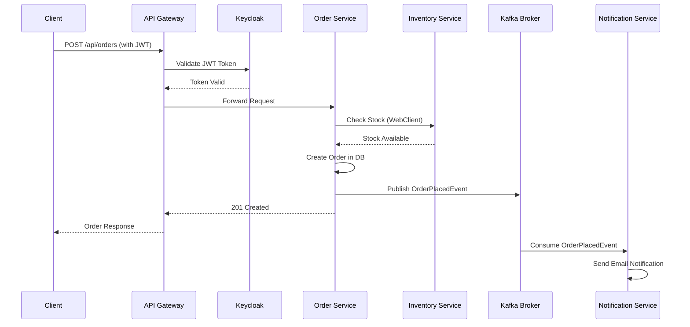

# 🛒 Distributed E-Commerce Microservices Platform

[](https://www.oracle.com/java/)
[](https://spring.io/projects/spring-boot)
[](https://spring.io/projects/spring-cloud)
[](https://kafka.apache.org/)
[](https://www.mongodb.com/)
[](https://www.mysql.com/)
[](https://www.docker.com/)

A production-ready, cloud-native e-commerce platform built with microservices architecture, showcasing modern design patterns, event-driven communication, comprehensive observability, and enterprise-grade resilience patterns.

## 📑 Table of Contents

- [Overview](#-overview)
- [System Architecture](#-system-architecture)
- [Microservices](#-microservices)
- [Infrastructure Components](#-infrastructure-components)
- [Technology Stack](#-technology-stack)
- [Prerequisites](#-prerequisites)
- [Getting Started](#-getting-started)
- [API Documentation](#-api-documentation)
- [Observability & Monitoring](#-observability--monitoring)
- [Architecture Patterns](#-architecture-patterns)
- [Contributing](#-contributing)

## 🎯 Overview

This project demonstrates a comprehensive implementation of cloud-native microservices architecture for an e-commerce platform. The system is designed to be **scalable**, **resilient**, **observable**, and **secure**, following industry best practices and modern design patterns.

### Key Highlights

- **Event-Driven Architecture** using Apache Kafka with Avro schema registry
- **Service Discovery** with HashiCorp Consul for dynamic service registration
- **API Gateway** pattern with Spring Cloud Gateway featuring security, routing, and resilience
- **Circuit Breaker** pattern using Resilience4J for fault tolerance
- **Distributed Tracing** with OpenTelemetry and Grafana Tempo
- **Centralized Logging** using Grafana Loki
- **Metrics & Monitoring** with Prometheus and Grafana
- **Security** implemented with Keycloak (OAuth 2.0/OIDC)
- **Polyglot Persistence** - MongoDB for products, MySQL for orders and inventory

## 🏗 System Architecture

### High-Level Architecture



### Request Flow



## 🔧 Microservices

### 1. Product Service

**Purpose**: Manages the product catalog with full CRUD operations and advanced search capabilities.

- **Port**: `8080`
- **Database**: MongoDB (port 27017)
- **Tech Stack**: Spring Boot, Spring Data MongoDB, MapStruct
- **Key Features**:
  - Product CRUD operations
  - Price range filtering
  - Keyword-based search
  - SKU lookup
  - Data validation with Bean Validation
  - Global exception handling

**API Endpoints**:
```
POST   /api/products              - Create a new product
GET    /api/products              - Get all products
GET    /api/products/{id}         - Get product by ID
PUT    /api/products/{id}         - Update product
DELETE /api/products/{id}         - Delete product
GET    /api/products/search/price - Search by price range (?min=X&max=Y)
GET    /api/products/search       - Search by keyword (?keyword=X)
GET    /api/products/sku/{sku}    - Get product by SKU code
```

### 2. Order Service

**Purpose**: Handles order placement, management, and coordinates with inventory service.

- **Port**: `8081`
- **Database**: MySQL (port 3306)
- **Tech Stack**: Spring Boot, Spring Data JPA, WebClient, Kafka, Resilience4J
- **Key Features**:
  - Order placement with inventory validation
  - Circuit breaker for inventory service calls
  - Kafka event publishing on order placement
  - Retry and timeout mechanisms
  - Database migrations with Flyway
  - Integration testing with Testcontainers

**API Endpoints**:
```
POST   /api/orders                - Place a new order
GET    /api/orders                - Get all orders
GET    /api/orders/{orderNumber}  - Get order details
DELETE /api/orders/{orderNumber}  - Cancel an order
```

**Resilience Configuration**:
- Circuit Breaker: 50% failure rate threshold, 5s wait duration
- Retry: 3 attempts with 5s wait duration
- Timeout: 3 seconds

### 3. Inventory Service

**Purpose**: Manages product inventory and stock availability.

- **Port**: `8082`
- **Database**: MySQL (port 3308)
- **Tech Stack**: Spring Boot, Spring Data JPA, Flyway
- **Key Features**:
  - Stock availability checking
  - Real-time inventory updates
  - Service interface pattern
  - Global exception handling

**API Endpoints**:
```
GET /api/inventory?skuCode={code}&quantity={qty} - Check stock availability
```

### 4. Notification Service

**Purpose**: Consumes order events and sends notifications to customers.

- **Tech Stack**: Spring Boot, Spring Kafka, Spring Mail, Avro
- **Key Features**:
  - Kafka consumer for order events
  - Email notification sending
  - Avro schema deserialization
  - Event-driven architecture

**Event Consumed**:
- **Topic**: `order-placed`
- **Schema**: OrderPlacedEvent (Avro)

## 🌐 Infrastructure Components

### API Gateway

- **Port**: `9000`
- **Framework**: Spring Cloud Gateway (Reactive)
- **Features**:
  - **Routing**: Dynamic service routing via Consul discovery
  - **Security**: OAuth2 JWT validation with Keycloak
  - **Resilience**: Circuit breaker, retry, and timeout patterns
  - **CORS**: Global CORS configuration
  - **Aggregated Swagger**: Single entry point for all service documentation
  - **Load Balancing**: Client-side load balancing with Spring Cloud LoadBalancer

**Route Configuration**:
```yaml
/api/products/**   → product-service
/api/orders/**     → order-service
/api/inventory/**  → inventory-service
```

### Service Discovery (Consul)

- **Port**: `8500`
- **Purpose**: Dynamic service registration and health checking
- **Features**:
  - Service registration with health checks
  - DNS-based service discovery
  - Load balancing support
  - Health check interval: 10 seconds

### Message Broker (Kafka)

- **Kafka Broker**: `localhost:9092`
- **Schema Registry**: `localhost:8085`
- **Serialization**: Avro with Confluent Schema Registry
- **Topics**: `order-placed`

### Security (Keycloak)

- **Port**: `8181`
- **Realm**: `ecommerce-realm`
- **Protocol**: OAuth 2.0 / OpenID Connect
- **JWT Validation**: All requests through API Gateway

## 💻 Technology Stack

### Core Frameworks
- **Java**: 21
- **Spring Boot**: 3.2.4 - 3.3.0
- **Spring Cloud**: 2023.0.1 - 2023.0.2
- **Maven**: Build tool

### Spring Modules
- Spring Web (REST APIs)
- Spring Data JPA (MySQL)
- Spring Data MongoDB
- Spring Cloud Gateway
- Spring Cloud Consul Discovery
- Spring Cloud LoadBalancer
- Spring Cloud Circuit Breaker (Resilience4J)
- Spring Kafka
- Spring Security (OAuth2 Resource Server)
- Spring Boot Actuator
- Spring Boot AOP

### Databases
- **MongoDB**: 7.0.5 (Product Service)
- **MySQL**: Latest (Order & Inventory Services)
- **Flyway**: Database migrations

### Messaging & Serialization
- **Apache Kafka**: Event streaming
- **Confluent Schema Registry**: Schema management
- **Apache Avro**: 1.11.3 - 1.12.1 (Serialization)

### Resilience & Fault Tolerance
- **Resilience4J**: Circuit Breaker, Retry, Time Limiter
- **Spring Cloud Circuit Breaker**: Abstraction layer

### Observability
- **Micrometer**: Metrics facade
- **Prometheus**: Metrics collection (via Micrometer Registry)
- **Grafana**: Visualization and dashboards
- **Grafana Loki**: Log aggregation (via Loki4j)
- **Grafana Tempo**: Distributed tracing
- **OpenTelemetry**: Observability framework
- **Zipkin Brave**: Tracing implementation

### Testing
- **JUnit 5**: Unit testing framework
- **Testcontainers**: Integration testing with Docker containers
- **REST Assured**: API testing
- **Mockito**: Mocking framework
- **Spring Cloud Contract**: Consumer-driven contracts

### Documentation
- **SpringDoc OpenAPI**: API documentation
- **Swagger UI**: Interactive API explorer

### Utilities
- **Lombok**: Boilerplate code reduction
- **MapStruct**: Object mapping
- **Bean Validation**: Input validation

### DevOps
- **Docker**: Containerization
- **Docker Compose**: Multi-container orchestration

## 📋 Prerequisites

Before running this application, ensure you have the following installed:

- **Java 21** or higher ([Download](https://www.oracle.com/java/technologies/downloads/))
- **Maven 3.8+** ([Download](https://maven.apache.org/download.cgi))
- **Docker Desktop** ([Download](https://www.docker.com/products/docker-desktop))
- **MongoDB** (via Docker or local installation)
- **MySQL** (via Docker or local installation)
- **Apache Kafka** (via Docker)
- **HashiCorp Consul** (via Docker)
- **Keycloak** (via Docker)
- **Git** ([Download](https://git-scm.com/downloads))

### Optional but Recommended
- **IntelliJ IDEA** or **VS Code** with Java extensions
- **Postman** or **Insomnia** for API testing
- **Docker Compose** for running the complete stack

## 🚀 Getting Started

### 1. Clone the Repository

```bash
git clone https://github.com/DiwakarAllu/highly-scalable-distributed-ecommerce-microservices.git
cd "highly-scalable-distributed-ecommerce-microservices"
```

### 2. Start Infrastructure Services

#### Option A: Using Docker Compose (Recommended)

Start MongoDB for Product Service:
```bash
cd product-service
docker-compose up -d
cd ..
```

Start MySQL and Kafka for Order Service:
```bash
cd order-service
docker-compose up -d
cd ..
```

Start MySQL for Inventory Service:
```bash
cd inventory-service
docker-compose up -d
cd ..
```

#### Option B: Manual Setup

**Start Consul**:
```bash
docker run -d -p 8500:8500 --name=consul consul agent -server -ui -node=server-1 -bootstrap-expect=1 -client=0.0.0.0
```

**Start Kafka & Zookeeper**:
```bash
# Refer to order-service/docker-compose.yml for Kafka setup
```

**Start Keycloak**:
```bash
docker run -d -p 8181:8080 -e KEYCLOAK_ADMIN=admin -e KEYCLOAK_ADMIN_PASSWORD=admin quay.io/keycloak/keycloak:latest start-dev
```

**Start Observability Stack** (Prometheus, Grafana, Loki, Tempo):
```bash
# Configure according to your observability requirements
```

### 3. Build All Services

```bash
# Build all services
mvn clean install -DskipTests

# Or build individually
cd product-service && mvn clean install
cd ../order-service && mvn clean install
cd ../inventory-service && mvn clean install
cd ../notification-service && mvn clean install
cd ../api-gateway && mvn clean install
```

### 4. Run Microservices

Open separate terminal windows for each service:

**Terminal 1 - Product Service**:
```bash
cd product-service
mvn spring-boot:run
```

**Terminal 2 - Inventory Service**:
```bash
cd inventory-service
mvn spring-boot:run
```

**Terminal 3 - Order Service**:
```bash
cd order-service
mvn spring-boot:run
```

**Terminal 4 - Notification Service**:
```bash
cd notification-service
mvn spring-boot:run
```

**Terminal 5 - API Gateway**:
```bash
cd api-gateway
mvn spring-boot:run
```

### 5. Verify Services are Running

Check Consul UI to see all registered services:
```
http://localhost:8500/ui
```

Check individual service health:
```bash
curl http://localhost:8080/actuator/health  # Product Service
curl http://localhost:8081/actuator/health  # Order Service
curl http://localhost:8082/actuator/health  # Inventory Service
curl http://localhost:9000/actuator/health  # API Gateway
```

## 📖 API Documentation

### Swagger UI Access

**Aggregated API Documentation** (via API Gateway):
```
http://localhost:9000/swagger-ui/index.html
```

**Individual Service Documentation**:
- Product Service: `http://localhost:8080/swagger-ui.html`
- Order Service: `http://localhost:8081/swagger-ui.html`
- Inventory Service: `http://localhost:8082/swagger-ui.html`

### Example API Requests

#### Create a Product
```bash
curl -X POST http://localhost:9000/api/products \
  -H "Content-Type: application/json" \
  -H "Authorization: Bearer YOUR_JWT_TOKEN" \
  -d '{
    "name": "iPhone 15 Pro",
    "description": "Latest iPhone with A17 Pro chip",
    "price": 999.99,
    "skuCode": "IPH15PRO-256-BLK"
  }'
```

#### Get All Products
```bash
curl http://localhost:9000/api/products \
  -H "Authorization: Bearer YOUR_JWT_TOKEN"
```

#### Search Products by Price Range
```bash
curl "http://localhost:9000/api/products/search/price?min=500&max=1500" \
  -H "Authorization: Bearer YOUR_JWT_TOKEN"
```

#### Place an Order
```bash
curl -X POST http://localhost:9000/api/orders \
  -H "Content-Type: application/json" \
  -H "Authorization: Bearer YOUR_JWT_TOKEN" \
  -d '{
    "skuCode": "IPH15PRO-256-BLK",
    "price": 999.99,
    "quantity": 1
  }'
```

#### Check Inventory
```bash
curl "http://localhost:9000/api/inventory?skuCode=IPH15PRO-256-BLK&quantity=1" \
  -H "Authorization: Bearer YOUR_JWT_TOKEN"
```

### Authentication

This system uses OAuth 2.0 with Keycloak. To obtain a JWT token:

1. Access Keycloak at `http://localhost:8181`
2. Login with admin credentials
3. Create a user in the `ecommerce-realm`
4. Obtain token via OAuth2 flow
5. Include token in `Authorization: Bearer <token>` header

## 📊 Observability & Monitoring

### Metrics (Prometheus)

Each service exposes metrics at:
```
http://localhost:<service-port>/actuator/prometheus
```

**Key Metrics**:
- HTTP request duration percentiles
- JVM memory and CPU usage
- Database connection pool metrics
- Circuit breaker states
- Kafka consumer lag

### Distributed Tracing (Tempo)

- **Sampling Rate**: 100% (configured for development)
- **Trace Context**: Propagated via HTTP headers
- **Visualization**: View traces in Grafana

### Centralized Logging (Loki)

All services send logs to Loki at `http://localhost:3100`

**Log Correlation**:
- Trace ID included in all log entries
- Service name tagged for filtering
- Structured logging with JSON format


## 🎨 Architecture Patterns

### 1. API Gateway Pattern
- Single entry point for all client requests
- Centralized authentication and authorization
- Request routing and load balancing
- Cross-cutting concerns (logging, monitoring)

### 2. Service Registry Pattern (Consul)
- Dynamic service registration
- Client-side service discovery
- Health checking and monitoring
- Load balancing

### 3. Circuit Breaker Pattern (Resilience4J)
- Prevents cascading failures
- Fast failure when service is down
- Automatic recovery attempts
- Fallback responses

### 4. Event-Driven Architecture (Kafka)
- Asynchronous communication
- Event sourcing capability
- Decoupled services
- Scalable message processing

### 5. Database per Service
- Each microservice owns its database
- Polyglot persistence (MongoDB + MySQL)
- Data autonomy and isolation
- Independent scaling

### 6. Strangler Fig Pattern
- Service interface abstraction
- Gradual migration capability
- Clean separation of concerns

### 7. Saga Pattern (Choreography)
- Distributed transactions via events
- Eventual consistency
- Compensation logic for rollbacks

## 🤝 Contributing

Contributions are welcome! This project demonstrates various microservices patterns and welcomes improvements.

### Development Workflow

1. **Fork the repository**
2. **Create a feature branch**: `git checkout -b feature/amazing-feature`
3. **Make your changes**
4. **Run tests**: `mvn verify`
5. **Commit your changes**: `git commit -m 'Add amazing feature'`
6. **Push to branch**: `git push origin feature/amazing-feature`
7. **Open a Pull Request**

### Code Standards

- Follow Java code conventions
- Add unit tests for new features
- Update documentation
- Use meaningful commit messages
- Ensure all tests pass

## 👨‍💻 Author

**Diwakar Allu**

- GitHub: [@DiwakarAllu](https://github.com/DiwakarAllu)
- Repository: [highly-scalable-distributed-ecommerce-microservices](https://github.com/DiwakarAllu/highly-scalable-distributed-ecommerce-microservices)

## 🙏 Acknowledgments

This project demonstrates real-world implementation of:
- Spring Boot and Spring Cloud ecosystem
- Microservices design patterns
- Event-driven architecture
- Cloud-native best practices
- Production-ready observability
